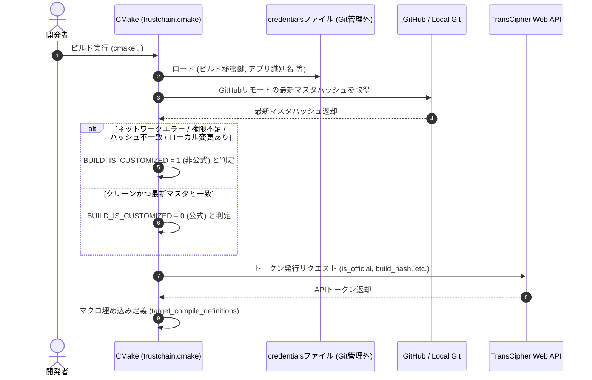
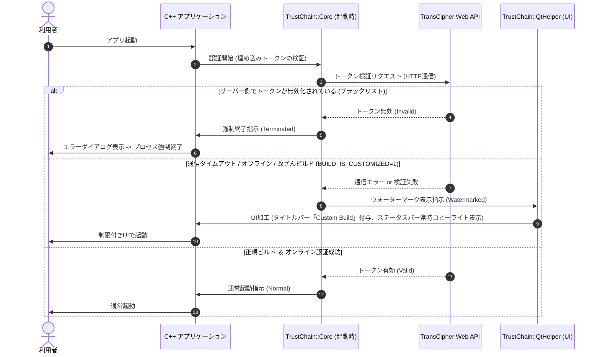

# TrustChain 基本設計書 (Basic Design)

本ドキュメントは、C++ (Qt6, C++20, Windows) アプリケーション向けの改ざん検知・オンライン認証フレームワーク「**TrustChain**」の基本設計書です。

---

## 1. システムアーキテクチャ

本フレームワークは、以下の4つの主要コンポーネントから構成されます。
`git submodule` として導入先プロジェクトに組み込まれ、CMakeを介してビルド時処理とC++へのマクロ注入がシームレスに行われます。

```
+---------------------------------------------------------------------------------+
|                                導入先 C++ アプリ                                 |
|                                                                                 |
|  +--------------------+    +-----------------------+    +--------------------+  |
|  |    CMakeLists      |    |       C++ Core        |    |     Qt Extension   |  |
|  | (ビルド環境構築)   |    | (起動時オンライン認証)|    |  (UIウォーターマーク)|  |
|  +---------+----------+    +-----------+-----------+    +---------+----------+  |
+------------|---------------------------|--------------------------|-------------+
             │ (①ビルド時トークン取得)   │ (②トークン検証)           │ (③UI自動変更)
             ▼                           ▼                          ▼
+---------------------------------------------------------------------------------+
|                              外部 TransCipher API                               |
+---------------------------------------------------------------------------------+
```

### 1.1. 各コンポーネントの役割

1. **`trustchain.cmake` (CMakeモジュール)**
   * ビルド時に GitHub API または Git コマンドを用いてリモートマスタの最新コミットハッシュを取得。
   * ローカルの状態と比較して「改ざん/非公式ビルド」を判定。
   * 認証情報の外部ファイル（`trustchain_credentials.cmake`）からビルド秘密鍵などをロード。
   * `TransCipher` Web API からトークンを取得し、C++コンパイルマクロとして埋め込む。
2. **`TrustChain::Core` (C++コアライブラリ)**
   * GUIに依存しない、標準C++20で記述されたセキュリティロジック。
   * 起動時に `TransCipher` 検証APIを呼び出してオンライン認証を実行。
   * 認証ステータス（`Normal`, `Watermarked`, `Terminated`）を保持・提供。
   * 「強制終了」が判定された場合、プロセスを安全にシャットダウンする。
3. **`TrustChain::QtHelper` (Qt6拡張ライブラリ)**
   * `TrustChain::Core` の判定結果に基づいて、Qt6 (QtWidgets) アプリケーションのUIを自動制御する。
   * タイトルバーへの `(Custom Build)` の強制追加、ステータスバーへのコピーライト（ウォーターマーク）強制表示などを行う。
4. **`trustchain_credentials.cmake` (ローカル認証情報ファイル / Git管理外)**
   * 開発環境ごとのパスや、公開リポジトリに載せるべきではないビルド秘密鍵、難読化キーなどの機密情報を記述する。
5. **`BinMarkManager` (外部ツール / 第3層バイナリ透かし)**
   * 本リポジトリから完全に独立した別リポジトリのモジュール。
   * ビルド完了後のリリースバイナリに対して、テキストタグ形式で暗号化された出自証明と平文コピーライトをファイルの末尾（オーバーレイ領域）に物理的に埋め込む。
   * 自動ビルドには組み込まず、手動またはセキュアなパイプラインで実行する。

---

## 2. 処理フローとシーケンス

### 2.1. ビルド時（CMake構成時）



### 2.2. アプリケーション起動・実行時



---

## 3. コンポーネント設計

### 3.1. セキュリティ情報の完全隔離 (設計思想)
ユーザーの「PCごとの環境情報や難読化キーをCMakeLists.txtに載せたくない」という思想に基づき、以下のセキュリティポリシーを策定します。

* **`trustchain_credentials.cmake` の分離**:
  * 以下の変数は `CMakeLists.txt` に直接記述せず、必ずこの外部ファイルから読み込む。
    * `TRANSCIPHER_BUILD_SECRET`: ビルド秘密鍵
    * `TRANSCIPHER_TOKEN_ISSUER_URL`: トークン発行用URL
    * `GITHUB_REPOSITORY_URL`: 差分チェック対象のGitHubリポジトリURL
  * このファイルはリポジトリのルート `.gitignore` に登録し、GitHubへの誤コミットを完全に防止する。
  * リポジトリにはテンプレートとして `trustchain_credentials.example.cmake` のみを配置する。

### 3.2. C++コア設計 (`TrustChain::Core`)
* **標準C++20準拠**:
  * Windows環境上の C++20 で動作し、GUIに一切依存しない設計とする。
  * HTTP通信は同期方式（または短いタイムアウトを伴う同期ブロッキング）で行い、認証が完了するまでメインスレッドの起動処理を一時保留する。これにより、認証をバイパスしてGUIが立ち上がるのを防ぐ。
* **状態管理**:
  * 認証結果を `enum class AuthStatus { Normal, Watermarked, Terminated }` で表す。

### 3.3. Qt6拡張設計 (`TrustChain::QtHelper`)
* **Qt6ベースのUI装飾**:
  * `BUILD_IS_CUSTOMIZED` が `1` の場合、あるいは `AuthStatus::Watermarked` の場合、Qtのウィジェットに対して以下の処理を実行するヘルパーを提供する。
    * メインウィンドウのタイトルバーの末尾に `(Custom Build)` を強制付与。
    * ステータスバー（`QStatusBar`）に開発者のコピーライト（例: `© BLUE000 (Original Creator)`）を常時強制表示し、他のメッセージでの上書きや非表示化を防ぐスタイルシートを設定する。

---

## 4. プラットフォームと前提条件

* **オペレーティングシステム**: Windows 10 / 11
* **開発言語・コンパイラ**: C++20 (MSVC 2022 以降、または GCC/MinGW)
* **GUIフレームワーク**: Qt6 (QtCore, QtWidgets, QtNetwork)
* **ビルドシステム**: CMake 3.16 以上
* **依存ツール**: Windows環境で動作する `git` コマンド, `curl` コマンド
